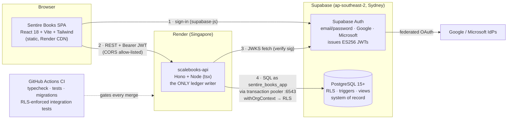
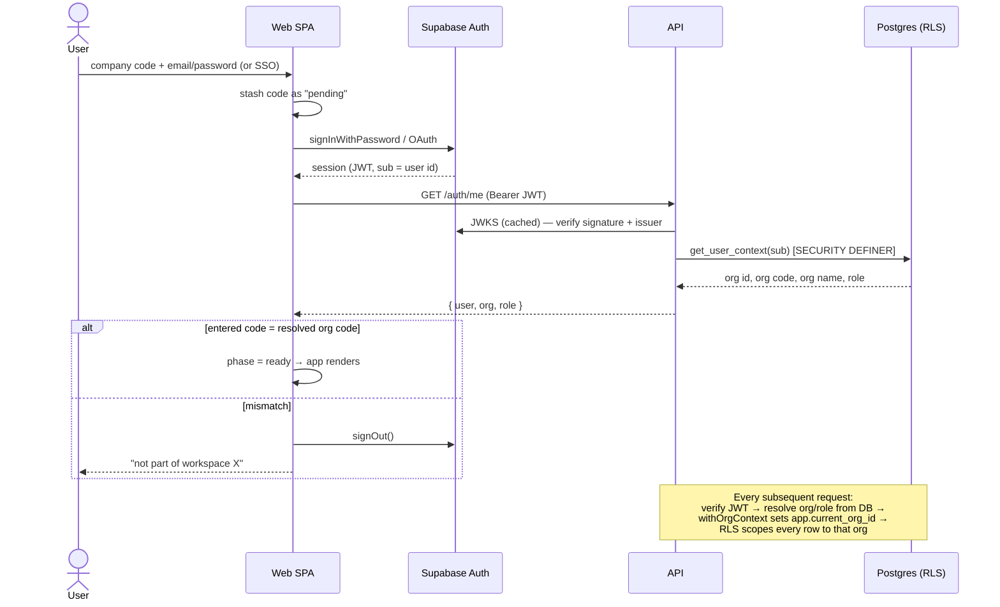
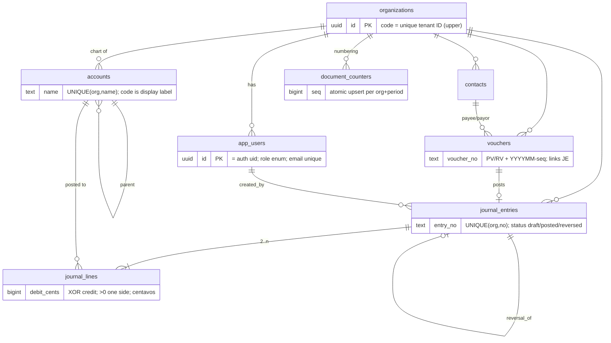

# Sentire Books — System Design, Requirements & Actors

> **Status:** Living document · **Product:** Sentire Books (accounting) · **Platform codename:** `scalebooks`
> **Sources of truth:** the running code in [`sentire-books-api/`](../sentire-books-api) (built) and the portal in [`sentire-books/`](../sentire-books) (fully migrated). Everything marked **✅ Built** is verified against the code as of this writing; **🔜 Roadmap** items come from the legacy system's proven workflows or stated plans.

---

## 1. Product Overview

**Sentire Books** is a multi-tenant, double-entry accounting system for Philippine SMEs. It is the first product of the **Sentire suite**:

| Product | Accent | Status |
|---|---|---|
| **Sentire Books** — bookkeeping, ledger, vouchers, reports | Blue `#3F66D6` | ✅ In production (core), migrating modules from legacy |
| **Sentire Payroll** — payslips, HRIS import, BIR forms, 13th month | Sage | 🔜 Owned by another team; integrates via vouchers + TRAIN tax domain |
| **Sentire Central** — cross-tenant operations portal (tenants, billing, releases, support) | Orange `#E8693A` | 🔜 Planned |
| Sentire Tax / POS | — | 💤 Concept (glyphs exist in the brand system) |

The current system replaces a legacy Firebase/Firestore app (now the fully migrated portal in `sentire-books/`) whose audit found open security rules, client-side-only validation, non-atomic multi-document writes, and floating-point money. The rebuild strategy is a **strangler migration**: the ledger core is rebuilt on a relational, ACID, type-safe stack, and legacy modules are ported on top of it one at a time.

### Design principles

1. **The database is the last line of defense.** Double-entry balance, append-only history, and tenant isolation are enforced by Postgres (triggers, constraints, RLS) — application checks are UX, not security.
2. **Money is integers.** All amounts are **centavos** (`bigint` in Postgres, safe integers in TS). `0.1 + 0.2` can never drift a trial balance.
3. **One writer to the ledger.** Only the API posts journal entries, through a single transactional code path.
4. **Identity is verified; authority is looked up.** JWTs prove *who* you are; *what you may do* (org, role) is always resolved server-side from the database, never from token claims.
5. **Corrections are new entries.** Posted entries are immutable; mistakes are fixed by reversing entries, keeping the audit trail tamper-evident.

---

## 2. Actors

### 2.1 Human actors

| Actor | Description | Access today |
|---|---|---|
| **Maker** | Encoder/bookkeeper. Drafts documents (journal entries, vouchers, billing) for review. | Sign in, read everything in their org, create contacts. Cannot post to the ledger. |
| **Verifier** | First checkpoint in the approval chain. Reviews Maker drafts for accuracy. | Same as Maker today; verification queue is 🔜 (legacy behavior). |
| **Approver** | Second checkpoint; management sign-off on documents before posting/payment. | Same as Maker today; approval queue is 🔜 (legacy behavior). |
| **Poster** | Authorized to commit to the ledger. Posts journal entries, reverses entries, creates vouchers. | ✅ Enforced: `canPost` gate on `POST /journal-entries`, `/journal-entries/:id/reverse`, `POST /vouchers`. |
| **Workspace Admin** | Manages the org: chart of accounts, users & roles, settings. Has all Poster rights. | ✅ Enforced: account creation is admin-only; everything Poster can do. 🔜 user management UI, settings. |
| **Platform Operator** (Sentire staff) | Operates Sentire Central: provisions tenants, billing, support. | 🔜 Central Portal. Today: manual provisioning via Supabase SQL Editor. |
| **External auditor** | Read-only examination of books for a period. | 🔜 (would be a read-only role; the append-only ledger and `reversal_of` links exist for this). |
| **Customer / Vendor / Employee** | Indirect actors — represented as `contacts`, referenced by vouchers and journal lines. They don't log in. | ✅ Data model exists. |

**Role model (enforced in code):** `user_role ∈ {maker, verifier, approver, poster, admin}` — stored on `app_users`, resolved server-side per request. Write gates today are coarse (`canPost` = poster|admin; account creation = admin). The full per-module, per-status approval chain from the legacy app (Draft → For Verification → For Approval → Approved → Paid/Posted) is the roadmap for these roles.

### 2.2 System actors

| Actor | Role in the system |
|---|---|
| **Web SPA** (`@sentire-books-api/web`) | React/Vite app; renders UI, performs client-side validation (UX only), holds the Supabase session. |
| **API** (`@sentire-books-api/api`) | Hono/Node service; the only ledger writer. Verifies JWTs, resolves org context, executes transactional postings. |
| **Authenticize** | Identity provider (self-hosted OIDC / OAuth 2.1 on Better Auth). Issues RS256 JWTs (email/password + Google). The API validates them via Authenticize's JWKS — no shared secret. |
| **PostgreSQL** | System of record. Enforces balance, immutability, uniqueness, and Row-Level-Security tenant isolation. |
| **Google IdP** | Upstream OAuth provider federated through Authenticize. |
| **Sliplane / Render** | Container hosting for web + API (+ Authenticize + Postgres). |
| **GitHub Actions CI** | Gatekeeper: typecheck, unit tests, migrations + RLS-enforced integration tests against ephemeral Postgres 16. |

### 2.3 Actor ↔ capability matrix (enforced today)

| Capability | maker | verifier | approver | poster | admin |
|---|:---:|:---:|:---:|:---:|:---:|
| Sign in (company code + email/SSO) | ✅ | ✅ | ✅ | ✅ | ✅ |
| Read accounts, journal, vouchers, reports, contacts (own org only) | ✅ | ✅ | ✅ | ✅ | ✅ |
| Create contacts | ✅ | ✅ | ✅ | ✅ | ✅ |
| Post journal entry | — | — | — | ✅ | ✅ |
| Reverse posted entry | — | — | — | ✅ | ✅ |
| Create voucher (posts JE atomically) | — | — | — | ✅ | ✅ |
| Create chart-of-accounts account | — | — | — | — | ✅ |
| Edit/delete a **posted** entry | 🚫 **nobody** — DB trigger blocks it; corrections are reversing entries | | | | |
| See another org's data | 🚫 **nobody** — RLS denies by default | | | | |

---

## 3. Requirements

### 3.1 Functional requirements — ✅ Built

**Identity & tenancy**
- **FR-AUTH-1** Users sign in with **company code (tenant ID) + work email + password**, or SSO (Google ✅ enabled, Microsoft wired — enable `azure` provider to activate). The company code is required for all paths.
- **FR-AUTH-2** After authentication, the system resolves the user's real org server-side (`GET /auth/me`) and rejects the login if the entered company code doesn't match the user's workspace.
- **FR-AUTH-3** A verified-but-unprovisioned user (no `app_users` row) is rejected with 403 — provisioning is explicit.
- **FR-AUTH-4** Password reset via emailed link; "keep me signed in" controls workspace-code persistence.
- **FR-TEN-1** Every organization has a globally unique, case-insensitive **company code**; all business data belongs to exactly one org.

**Chart of accounts**
- **FR-COA-1** Each org has a chart of accounts: 5 types (asset, liability, equity, income, expense), non-unique display `code`, unique `name` per org, parent hierarchy, subtype, normal balance, active flag.
- **FR-COA-2** New orgs are provisioned with the **158-account Philippine default chart** (generated from the company's real Zoho export; 104 parent links), including bank accounts, per-client receivables, tax accounts, and PPE hierarchy.
- **FR-COA-3** Admins can add accounts; duplicate names are rejected (409).

**General ledger**
- **FR-LED-1** Journal entries have ≥ 2 lines; every line is debit-XOR-credit, non-negative, non-zero.
- **FR-LED-2** A posted entry **must balance** (Σdebit = Σcredit > 0) — validated in the client (UX), the API (422), and finally by a deferred Postgres constraint trigger at COMMIT (authoritative).
- **FR-LED-3** Posting is atomic: number allocation → entry → lines → status flip happen in one transaction; partial writes are impossible.
- **FR-LED-4** Entry numbers are per-org, per-month, gap-tolerant and **race-free**: `JE202607-0001` style, allocated by an atomic `document_counters` upsert; `UNIQUE(org_id, entry_no)` backstops.
- **FR-LED-5** Posted entries are **append-only**: no edit, no delete (DB triggers). The only permitted mutation is `posted → reversed`.
- **FR-LED-6** Reversal creates a **new** posted entry with swapped debit/credit lines, memo `Reversal of <no>`, and a `reversal_of` link; the original is marked `reversed`.

**Vouchers**
- **FR-VCH-1** Payment (`PV…`) and Receipt (`RV…`) vouchers with contact, date, memo, cash/bank account, and ≥ 1 detail line (strictly positive amounts).
- **FR-VCH-2** A voucher and its journal entry are created **in one transaction** — the JE lines are balanced by construction (details vs. cash side). An orphaned voucher or unlinked JE is impossible (the legacy system's worst defect, fixed structurally).

**Contacts** — **FR-CON-1** Vendor / customer / employee master data with PH TIN, email, phone, address; filterable lists.

**Reporting**
- **FR-REP-1** Trial balance per account with debit/credit totals and a balanced flag, filterable by date range; computed in SQL over **posted** lines only.
- **FR-REP-2** Profit & Loss (income, expenses, net profit) for a period, sign-corrected by normal balance.
- **FR-REP-3** Reports respect tenancy automatically: views run `security_invoker` so RLS applies to every report query.

**Money & tax domain**
- **FR-MNY-1** All money is integer centavos end-to-end; robust peso parsing (rejects, never coerces, bad input); `Intl` PHP formatting with a privacy-mask option.
- **FR-TAX-1** BIR **TRAIN graduated income-tax** table (2023+) implemented in centavos, incl. minimum-wage-earner exemption — ready for Payroll integration.

### 3.2 Functional requirements — 🔜 Roadmap (from the proven legacy system, in rough priority order)

| # | Requirement | Legacy evidence |
|---|---|---|
| **FR-APR-1** | Multi-stage approval chain per document type (Draft → For Verification → For Approval → Approved → Paid/Posted), configurable routing incl. delegates; unified "My Approvals" queue with bulk approve/reject + remarks | `ApprovalsPage`, Settings approval routing |
| **FR-CHK-1** | Check management: checkbooks (number ranges, next-check counters), check register (Issued/Cleared/Voided/Stopped/Stale), CHECK vouchers, atomic check issuance shared across modules | `CheckRegistryPage`, `issueCheck.js` |
| **FR-PDF-1** | Vector PDF generation: voucher PDF, check voucher PDF, disbursement report PDF (A4, signature blocks) | jsPDF modals |
| **FR-DSB-1** | Weekly disbursement reports aggregating approved vouchers with per-bank balance snapshots and balance-after computation | `DisbursementsPage` |
| **FR-BIL-1** | Billing statements & service invoices with PH tax groups (VAT / VAT+EWT / EWT / Exempt) and lifecycle Draft→…→Sent→Partial→Paid | `BillingPage`, `ServiceInvoicesPage` |
| **FR-COL-1** | Collections (AR receipts): Cash/Check/Transfer/GCash/PayMaya/Wire, Unposted→Posted→Voided, unapplied-amount tracking | `CollectionsPage` |
| **FR-BNK-1** | Bank module: balances, credit lines, transactions, reconciliation | `BankPage` |
| **FR-SCH-1** | Recurring payment schedule (rent, utilities, loans, tax…) with calendar matrix and one-click voucher generation | `PaymentSchedulePage` |
| **FR-PRJ-1** | Weekly cash projections (outflows per bank + expected inflows) with their own approval flow | `ProjectionsPage` |
| **FR-LON-1** | Loan registry & amortization (Reducing Balance, Straight-Line, Fixed, Balloon, Revolving); payment recording that auto-clears linked checks; Excel export | `FinancialPage` |
| **FR-AST-1** | Fixed assets: registry, depreciation (SL, 150/200 DB, pro-rata), batch depreciation posting, installment tracking | `FixedAssetsPage` |
| **FR-TAXM-1** | Tax registry (VAT/EWT rates & groups), tax entries, tax summary | `TaxPage` |
| **FR-RPT-2** | Report catalogue: Balance Sheet, General Ledger, AR Aging, Payment Schedule report (legacy builder was a stub — build on the SQL-view pipeline) | `ReportsLandingPage` |
| **FR-DSH-1** | Dashboard with customizable widgets (P&L, pending approvals, bank balances, billed/collected) and privacy mask | `DashboardPage` |
| **FR-ADM-1** | Settings: org profile, users & roles matrix, user invitations by email, approval routing, document numbering, purpose categories, payment terms | `SettingsPage`, `createAuthUser` fn |
| **FR-COA-4** | Chart-of-accounts Excel import wizard (column mapping) | `COAPage` |
| **FR-CEN-1** | **Sentire Central**: tenant provisioning/administration, org-code management, cross-tenant support tooling; users-in-multiple-workspaces via a memberships table | Stated roadmap; login screen `mode="admin"` designed |
| **FR-PAY-1** | Payroll integration: payroll/final-pay vouchers, BIR 2316, HRIS import — via Sentire Payroll (external team), consuming `computeAnnualTax` and the voucher API | Legacy home card; `trainTax.ts` |

### 3.3 Non-functional requirements

| # | Requirement | How it's met |
|---|---|---|
| **NFR-INT-1** Ledger integrity | Balance + append-only enforced **in Postgres** (deferred constraint triggers, immutability triggers, CHECK constraints) — survives any app bug. ✅ |
| **NFR-INT-2** Money precision | Integer centavos everywhere; no floats in any money path. ✅ |
| **NFR-SEC-1** Tenant isolation | Postgres RLS on every org table, deny-by-default (`app.current_org_id` GUC per transaction); API connects as non-owner `sentire_books_app` so RLS always applies. A forgotten `WHERE org_id` cannot leak data. ✅ |
| **NFR-SEC-2** Authentication | Asymmetric JWT verification (JWKS, ES256) — no shared secrets in the API; org/role resolved from DB, never from claims. ✅ |
| **NFR-SEC-3** Secrets hygiene | DB credentials only in Render env vars; publishable Supabase key is the only key shipped to browsers; `AUTH_DEV_BYPASS` is local-only — and structurally inert in production: the bypass path is only reachable when **no** `AUTH_JWKS_URL` is configured, so with JWKS set the header is ignored entirely. ✅ |
| **NFR-SEC-4** Least privilege | Coarse role gates on writes today; full approval-chain RBAC 🔜. |
| **NFR-AUD-1** Auditability | Immutable posted entries, `reversal_of` chains, `created_by`/`posted_at` stamps, sequential doc numbers. ✅ Field-level audit log 🔜. |
| **NFR-REL-1** Availability | Render Starter (no cold starts) + `/health` checks + auto-deploy; Supabase managed Postgres. Auth favors availability on transient API failures (session kept; RLS still protects). ✅ |
| **NFR-REL-2** Consistency | Every multi-step write is one ACID transaction; document numbering is race-free under concurrency. ✅ |
| **NFR-QLT-1** Quality gates | CI on every push/PR: typecheck (strict TS incl. `exactOptionalPropertyTypes`), 30+ unit tests, build, migrations applied fresh, 9 integration tests running **as the RLS-bound role**. ✅ |
| **NFR-PRF-1** Performance | Indexed org-scoped queries; report aggregation in SQL; pooled connections (transaction pooler, `prepare:false`). Note: API (Singapore) ↔ DB (Sydney) cross-region hop — acceptable now, revisit if latency-sensitive workloads grow. |
| **NFR-CMP-1** PH compliance orientation | PHP currency, TIN capture, TRAIN tax table, BIR-oriented tax groups (VAT/EWT) in roadmap modules. |
| **NFR-UX-1** Responsive, branded UI | Sentire design system (Instrument Sans / Hanken Grotesk, product accents); login is container-query responsive; pixel-fidelity to design handoffs. ✅ |

---

## 4. System Design

### 4.1 Architecture

**Monorepo layout** (`sentire-books-api/`, pnpm workspaces + Turborepo, strict TypeScript):

| Package | Purpose |
|---|---|
| `packages/domain` | Pure business logic: Zod schemas, centavo money math, voucher line construction, TRAIN tax, default chart. Shared FE ↔ BE; 100% unit-tested. |
| `packages/db` | Drizzle schema, hand-written SQL migrations (incl. triggers/RLS that ORMs can't express), `withOrgContext`, seed. |
| `apps/api` | Hono API. Auth middleware, route handlers, transactional ledger flows. |
| `apps/web` | React SPA. Login (Sentire design), Journal, Vouchers, Reports, Contacts; React Query for data. |

### 4.2 Identity, tenancy & the login flow

Key properties:

- **The company code is a workspace gate, not a security boundary.** Even if the client check were bypassed, `get_user_context` resolves the caller's *own* org and RLS confines every query to it. Isolation never depends on client input.
- **Two DB roles:** migrations/seed run as the table **owner** (RLS-exempt, direct :5432); the API runs as **`sentire_books_app`** (RLS-bound, pooler :6543, `prepare:false`). Production `DATABASE_URL` must always point at `sentire_books_app`.
- **Availability bias:** a transient `/auth/me` failure never destroys a valid session; only a definitive 401/403 or code mismatch signs out. Background token refreshes never re-block the UI.
- **Local dev:** the API accepts an `x-user-id` header only when `AUTH_JWKS_URL` is unset **and** `AUTH_DEV_BYPASS=true`; once JWKS is configured (production), the bypass path is unreachable regardless of the flag.

### 4.3 Data model

**Ledger invariants (enforced by the database):**

| # | Invariant | Mechanism |
|---|---|---|
| 1 | Posted entries balance: Σdebit = Σcredit > 0 | `DEFERRABLE INITIALLY DEFERRED` constraint triggers on lines and on the posted-status flip — checked once at COMMIT |
| 2 | Posted entries are append-only | `BEFORE UPDATE/DELETE` triggers; only `posted → reversed` (all else unchanged) is allowed; lines of a posted entry are frozen |
| 3 | Lines are well-formed | CHECKs: non-negative, debit XOR credit, at least one side > 0 |
| 4 | No duplicate/racing document numbers | Atomic counter upsert + `UNIQUE(org_id, entry_no)` / `UNIQUE(org_id, voucher_no)` |
| 5 | No cross-tenant access | RLS `org_isolation` policies on every table (lines inherit org via their entry), deny-by-default when context is unset |

**Reporting** reads flow through `security_invoker` views (`v_account_postings`, `v_trial_balance`) over **posted** lines only, so RLS applies to every report.

### 4.4 API surface (today)

| Endpoint | Gate | Behavior |
|---|---|---|
| `GET /health` | none | liveness for Render |
| `GET /auth/me` | authenticated | user + resolved org (id, name, **code**) + role |
| `GET /accounts` · `POST /accounts` | auth · **admin** | list chart / add account (409 on duplicate name) |
| `GET /journal-entries` · `GET /journal-entries/:id` | auth | last 100 / entry with lines |
| `POST /journal-entries` | **poster\|admin** | transactional post; 422 if unbalanced |
| `POST /journal-entries/:id/reverse` | **poster\|admin** | reversing entry + mark original reversed (404 unknown id · 409 not posted) |
| `GET /reports/trial-balance?from&to` · `GET /reports/profit-and-loss?from&to` | auth | SQL-aggregated, RLS-scoped |
| `GET /contacts?type` · `POST /contacts` | auth | master data |
| `GET /vouchers` · `POST /vouchers` | auth · **poster\|admin** | list / atomic voucher+JE |

Error contract: `400 validation_error` (Zod issues) · `401 unauthenticated` · `403 forbidden` (role / not provisioned) · `404 not_found` · `409 duplicate_*` / `invalid_status` (state conflicts, e.g. reversing a non-posted entry) · `422 unbalanced {debit, credit}` · `500 internal_error`.

### 4.5 Deployment & environments

| Environment | Web | API | Database / Auth |
|---|---|---|---|
| **Production** | Render static `scalebooks-web` (SPA rewrite `/* → /index.html`) | Render Node `scalebooks-api`, Singapore, Starter plan, `/health` checks, auto-deploy from `main` | Supabase project (Sydney): Postgres via transaction pooler as `sentire_books_app`; Auth with Google (+ Microsoft when enabled) |
| **CI** | build only | integration tests **as `sentire_books_app`** (RLS on) | ephemeral `postgres:16` service; migrations applied by glob |
| **Local dev** | Vite :5173 | :8787, `AUTH_DEV_BYPASS` header flow | any Postgres; no IdP needed |

Config is env-driven (`DATABASE_URL`, `AUTH_JWKS_URL`, `AUTH_ISSUER`, `CORS_ORIGIN`, `VITE_API_BASE_URL`, `VITE_SUPABASE_*`); secrets live only in the Render dashboard. First-time tenant provisioning is a one-paste `setup/db-setup.sql` (schema + triggers + RLS + views + org & company code + 158-account chart + admin mapping).

Known trade-off: API compute (Singapore) and Postgres (Sydney) are in different regions; fine at current scale, revisit co-location if query latency becomes material.

### 4.6 Migration strategy (legacy → Sentire Books)

Strangler order, driven by integrity risk first:

1. ✅ **Ledger core** — COA, journal, posting invariants, RLS, reports
2. ✅ **Vouchers + Contacts** — atomic voucher↔JE (fixes the legacy orphan-document bug)
3. ✅ **Tenanted login** — company code + SSO (Sentire Books design)
4. 🔜 **Approvals engine** — status machine + queue (unlocks Verifier/Approver roles properly)
5. 🔜 **Checks + Disbursements + PDFs** — next-worst legacy integrity risks (shared `issueCheck`, per-bank snapshots)
6. 🔜 **Billing / Invoices / Collections** — AR cycle with PH tax groups
7. 🔜 **Bank, Schedule, Projections** — cash operations
8. 🔜 **Loans (Financial) + Fixed Assets** — amortization & depreciation engines posting through the same ledger core
9. 🔜 **Settings & user administration** — roles matrix, invitations, approval routing, doc numbering
10. 🔜 **Dashboard + report catalogue** — on the SQL-view pipeline
11. 🔜 **Sentire Central** — tenant ops portal; memberships (user ↔ many orgs)
12. 🤝 **Sentire Payroll** — external team; integrates via voucher API + shared TRAIN tax domain

Every migrated module must post through `postJournalEntryCore` (no second writer), carry org RLS, and land with integration tests running as the RLS-bound role.

---

## 5. Glossary

| Term | Meaning |
|---|---|
| **Company code** | Human-friendly unique tenant ID (e.g. `ACMEFOODS`) required at login; case-insensitive. |
| **Centavos** | 1/100 PHP; the only money unit in code and DB (integer). |
| **Posting** | Committing a balanced journal entry to the ledger; irreversible except by reversal. |
| **Reversal** | New posted entry with swapped debit/credit lines linked via `reversal_of`. |
| **RLS** | Postgres Row-Level Security — per-row tenant isolation enforced by the database. |
| **JWKS** | Public-key set exposed by Supabase Auth; lets the API verify JWTs without shared secrets. |
| **Strangler migration** | Rebuilding module-by-module on the new core while the legacy app keeps serving the rest. |
| **`scalebooks`** | Internal platform codename (packages, DB role, service names); the product brand is **Sentire Books**. |
